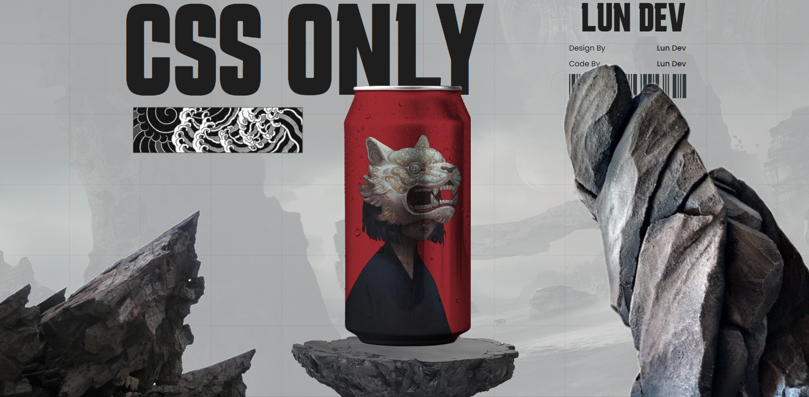

# 🍹 SodaCSS 

Um projeto criativo feito em **HTML + CSS puro**, onde uma lata de refrigerante ganha vida com **animações e transições interativas** ao passar o mouse.  
Sem JavaScript, apenas o poder do CSS! ✨

---

## 🎨 Demonstração  

Quando o usuário passa o mouse sobre a lata, o design do refrigerante muda e elementos visuais (como rochas e efeitos) se movimentam, criando uma sensação de **dinamismo e interatividade**.  

---

## 🚀 Tecnologias utilizadas  

- **HTML5** – Estrutura da página  
- **CSS3** – Animações, efeitos de máscara e transições  
- **Google Fonts** – Poppins e Karantina para tipografia  

---

## 📂 Estrutura de pastas  

```
.
├── index.html
├── styles/
│   └── style.css
└── img/
    ├── bg.jpg
    ├── bg.png
    ├── bg2.png
    ├── mockup.png
    ├── rock1.png
    ├── rock2.png
    ├── rock3.png
    ├── 2.png
    └── code.png
```

---

## 🖼️ Preview  

  


---

## ⚡ Como executar  

1. Clone o repositório:  
   ```bash
   git clone https://github.com/SEU-USUARIO/CSSoda.git
   ```
2. Abra o arquivo `index.html` em seu navegador.  
3. Passe o mouse sobre a lata e aproveite a animação! 🎉


